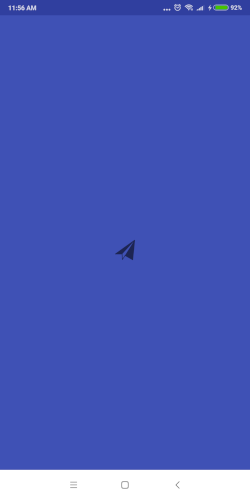

The project uses Retrofit to fetch data from API. The fetched data is save to a database using Room ORM. MVVM architecture is employed. LiveData and ViewModels are used to populate data to UI.

**A signed apk is available inside /app/release/app-release.apk.**

   
